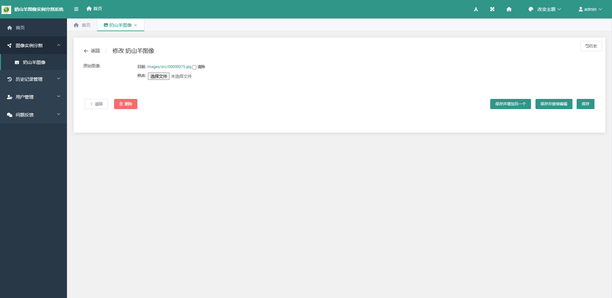

# 奶山羊图像实例分割系统

[toc]

## 系统介绍

本系统是一种基于B/S架构的奶山羊图像实例分割系统，旨在为奶山羊图像信息监测技术的改进研究和奶山羊精准养殖的实践提供便利。

## 环境搭建

### 搭建MMdetection环境

#### 安装mim并使用mim安装mmcv基础库

首先，请根据运行环境安装**PyTorch**框架，请参考以下命令：

```shell
conda create --name seg-sys python=3.8 -y
# seg-sys可更换为任何喜欢的名字
conda activate seg-sys
conda install pytorch==1.10.1 torchvision==0.11.2 torchaudio==0.10.1 cudatoolkit=11.3 -c pytorch -c conda-forge
```

在安装**PyTorch**框架后，请执行以下命令：

```shell
pip install -U openmim
mim install mmengine
mim install mmcv-full==1.7.0
```

#### 安装MMDetection

请执行以下命令：

```shell
cd mmdetection
git checkout ywding1994
# 本项目对mmdetection的代码进行了一定的更改，若需要使用原始mmdetection，请执行该命令：git clone https://github.com/open-mmlab/mmdetection，切换至2.25.1版本并安装（3.0及以上的版本会报错）。
pip install -r requirements/build.txt
pip install -v -e .
# "-v" 指详细说明，或更多的输出
# "-e" 表示在可编辑模式下安装项目，因此对代码所做的任何本地修改都会生效，从而无需重新安装。
```

### 搭建Django环境

#### 安装相关依赖

请执行以下命令：

```shell
cd segmentation_system
pip install -r requirements.txt
```

#### 初始化数据库

请执行以下命令：

```shell
cd segmentation_system
python manage.py makemigrations
python manage.py migrate
python manage.py createsuperuser
# 创建管理员账号，按提示操作即可。
```

## 使用说明

### 系统启动

请执行以下命令：

```shell
cd segmentation_system
python manage.py runserver
# 默认端口号为8000。如果想更改为其他端口，如8006，可执行：python manage.py runserver 8006
```

启动成功后，打开<http://127.0.0.1:8000/admin/>，用户将看到如下登录界面：


正确输入账号密码后，即可登录系统。系统主界面如下：


### 图像实例分割

#### 准备工作

在使用该功能之前，请确保已在[detector文件](model/detector.py)中正确设置了模型配置（CONFIG）和模型文件（CHECKPOINT）的路径。此外，如果使用CPU进行推理，请设置为```DEVICE = "cpu"```。
在界面左侧单击【*图像实例分割-奶山羊图像*】菜单，将看到如下界面：


#### 上传奶山羊图像进行实例分割

用户可以单击“*增加-选择文件-保存*”或“*奶山羊图像上传-选择文件-确定*”按钮上传奶山羊图像，上传成功后，图像会自动进行实例分割。分割完成后，界面中会增加一条记录，显示原图像、分割结果和掩码图像，如下图所示：


#### 奶山羊图像记录管理

对于已有的奶山羊图像记录，用户可以进行下载、删除或更改操作。进行下载和删除操作时，用户需要选择至少一条记录，然后单击对应按钮即可。进行更改操作时，用户可以单击记录的id或原始图像进入修改界面，如下图所示：



选择需要更改的奶山羊图像并单击保存按钮，系统将保存新的图像并自动对其进行实例分割，操作完毕后，界面中将显示更改后的记录，如下图所示。


### 历史记录管理

每当用户上传图像或更改已有的图像记录时，都会自动生成一条操作记录。在界面左侧单击【*历史记录管理-操作记录*】菜单，即可查看操作记录，如下图所示。


操作记录的生成过程是自动的，用户无法手动增加操作记录，只能对操作记录进行浏览、搜索和删除操作。

### 用户管理

该模块为**Django**框架自带的**auth**应用，提供了用户管理、组管理等功能，请自行搜索使用方法。

### 问题反馈

#### 反馈意见管理

在界面左侧单击【*问题反馈-反馈意见*】菜单，即进入问题反馈界面，如下图所示。


单击*增加*按钮，进入增加反馈意见界面，依次填写反馈意见、具体描述、反馈意见类型，单击*保存*按钮即提交了一条反馈意见，如下图所示。


此外，用户可以对已有的反馈意见进行浏览、搜索和删除操作。

#### 反馈意见导出

在问题反馈界面，选择至少一条反馈意见后，可以单击*导出选中的反馈意见*按钮进行导出。在进行导出操作之前，用户应选择所希望的导出格式，本系统提供了csv、xls、json等多种导出格式，其中默认的格式为xls。
